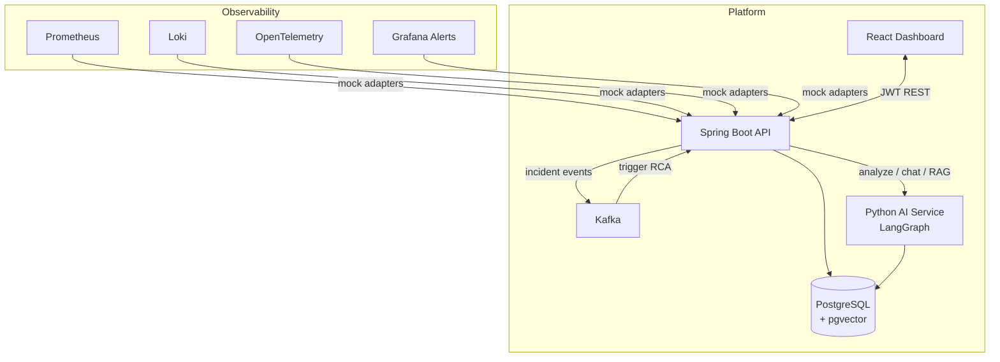

# InSeeDent

**AI-powered incident intelligence platform** for DevOps/SRE teams. InSeeDent ingests logs, metrics, traces, alerts, and deployment events from observability stacks, then runs a **LangGraph multi-agent workflow** to correlate signals and surface probable root causes with confidence scores and remediation steps.

## Architecture



### LangGraph agent workflow

```
START → log_agent → metrics_agent → trace_agent → deployment_agent
      → correlation_agent → summarizer_agent → END
```

| Agent | Role |
|-------|------|
| Log Agent | ERROR patterns, pool exhaustion, circuit breakers |
| Metrics Agent | Latency/error spikes, SLO breaches |
| Trace Agent | Failed spans, critical path bottlenecks |
| Deployment Agent | Change correlation with incident window |
| Correlation Agent | Cross-signal causal narrative |
| Summarizer | Root cause, confidence, remediation |

See [`ai-service/app/workflow/graph.py`](ai-service/app/workflow/graph.py) for implementation comments.

## Tech stack

| Layer | Technology |
|-------|------------|
| Backend | Java 17, Spring Boot 3.2, JWT, Flyway |
| AI | Python, FastAPI, LangGraph, LangChain |
| Frontend | React 18, TypeScript, TailwindCSS, Recharts |
| Database | PostgreSQL + pgvector |
| Messaging | Kafka |
| Containers | Docker Compose |

## Quick start (Docker)

```bash
git clone <repo>
cd in-see-dent
cp .env.example .env   # optional: set OPENAI_API_KEY for live LLM
docker compose up --build
```

| Service | URL |
|---------|-----|
| Dashboard | http://localhost:5173 |
| Backend API | http://localhost:8080 |
| Swagger UI | http://localhost:8080/swagger-ui.html |
| AI Service | http://localhost:8090/docs |

**Demo login:** `admin` / `admin123`

## Local development

### Prerequisites

- Java 17+, Maven
- Node 18+, npm
- Python 3.11+
- PostgreSQL 16 with pgvector (or use Docker for infra only)

### Infrastructure only

```bash
docker compose up postgres kafka zookeeper ai-service -d
```

### Backend

**Without Docker** (embedded H2 database — easiest):

```bash
cd backend
mvn spring-boot:run -Dspring-boot.run.profiles=local
```

**With Docker Postgres** (`docker compose -f docker-compose.db.yml up -d`):

```bash
cd backend
mvn spring-boot:run -Dspring-boot.run.profiles=dev
```

Both profiles disable Kafka. Demo login: `admin` / `admin123`.

### AI service

Use the project venv (avoids pip conflicts with global packages):

```bash
cd ai-service
chmod +x run.sh
./run.sh
```

Or manually:

```bash
cd ai-service
python3 -m venv .venv && source .venv/bin/activate
pip install -r requirements.txt
PYTHONPATH=. uvicorn app.main:app --reload --port 8090
```

### Frontend

```bash
cd frontend
npm install
npm run dev
```

## Demo flow

1. Sign in with `admin` / `admin123`
2. Open an incident from the dashboard
3. Click **Ingest Mock Telemetry** (Prometheus/Loki/OTel/Grafana mock data)
4. Click **Run AI RCA** — or create a new incident to auto-trigger via Kafka
5. Use the **Investigation Assistant** chat sidebar
6. Review timeline, confidence score, and similar incidents

## API overview

| Endpoint | Description |
|----------|-------------|
| `POST /api/auth/login` | JWT authentication |
| `GET /api/v1/incidents` | List/filter incidents |
| `GET /api/v1/incidents/{id}/timeline` | Chronological events |
| `POST /api/v1/incidents/{id}/analysis` | Trigger LangGraph RCA |
| `POST /api/v1/observability/incidents/{id}/ingest-mock` | Mock telemetry ingest |
| `POST /api/v1/chat` | Investigation assistant |
| `GET /api/v1/search/incidents/{id}/similar` | RAG similar incidents |
| `GET /api/v1/services/dependencies` | Service dependency graph |

Full OpenAPI docs: http://localhost:8080/swagger-ui.html

## Project structure

```
in-see-dent/
├── backend/          # Spring Boot REST API, Kafka, JWT
├── ai-service/       # LangGraph orchestration + RAG
├── frontend/         # React DevOps dashboard
├── docker-compose.yml
└── README.md
```

## Sample agent prompts

Located at [`ai-service/app/prompts/sample_prompts.yaml`](ai-service/app/prompts/sample_prompts.yaml).

## License

MIT — built for hackathon/demo use.
