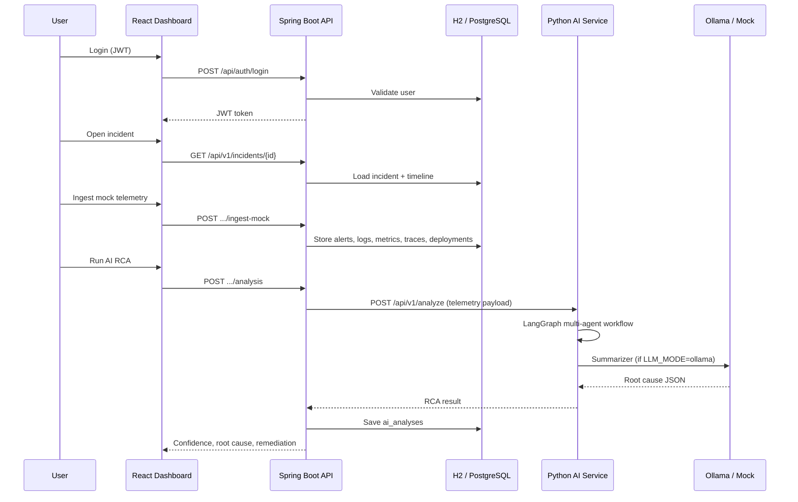
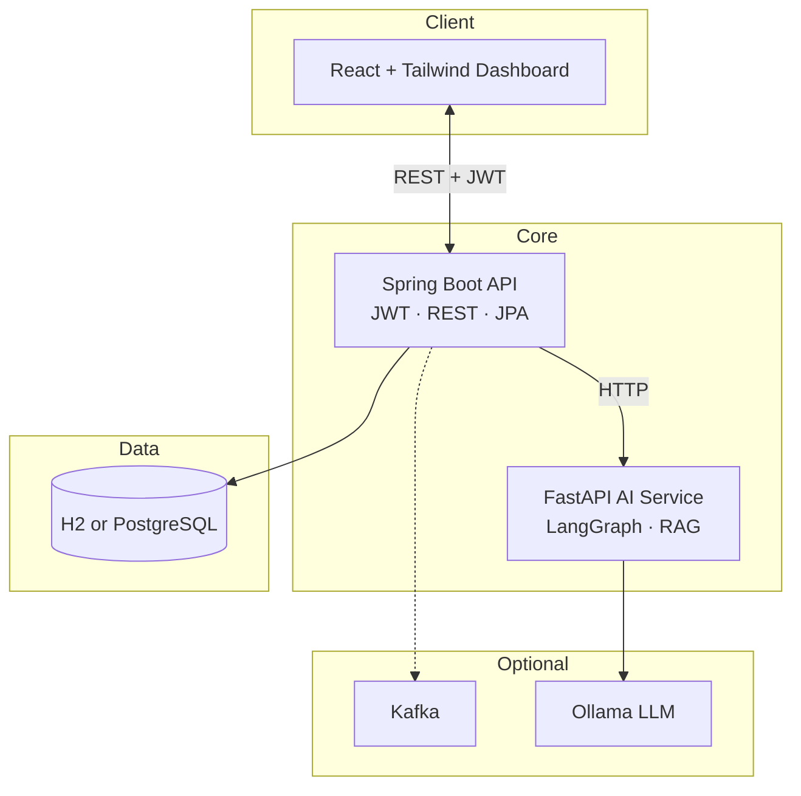

# InSeeDent

**InSeeDent** is an AI-powered incident intelligence platform for DevOps and SRE teams. It collects signals from observability tools (logs, metrics, traces, alerts, deployments), runs a **multi-agent root cause analysis (RCA) workflow**, and presents results in a dark-themed operations dashboard with chat-based investigation.

---

## What it does

| Capability | Description |
|------------|-------------|
| **Incident dashboard** | List, filter, and drill into active production incidents |
| **Telemetry ingestion** | Mock adapters for Prometheus, Loki, OpenTelemetry, and Grafana (demo-ready) |
| **Incident timeline** | Chronological alerts, deployments, metric spikes, trace errors |
| **AI root cause analysis** | LangGraph pipeline: log → metrics → trace → deployment → correlation → summary |
| **Investigation chat** | Ask questions like *“Why did checkout-service fail?”* |
| **Similar incidents (RAG)** | Match against historical incidents and runbooks |
| **Service dependency graph** | Visual map of service health and dependencies |

---

## How it works (end-to-end)



### Request flow (three services)

1. **Frontend** (`localhost:5173`) — React app; proxies `/api` to the backend in dev.
2. **Backend** (`localhost:8080`) — REST API, JWT auth, persistence, calls AI service.
3. **AI service** (`localhost:8090`) — LangGraph orchestration, RAG, optional LLM.

Optional: **Kafka** publishes `INCIDENT_CREATED` to auto-ingest telemetry and trigger RCA (enabled in full Docker Compose; disabled in `local` / `dev` profiles).

---

## AI and LLM modes

**By default, InSeeDent does not call any cloud API.** It uses a **rule-based mock engine** that produces realistic RCA from telemetry patterns (suitable for demos and offline use).

| `LLM_MODE` | Description | Internet required |
|------------|-------------|-------------------|
| **`mock`** (default) | Deterministic multi-agent logic + heuristics | No |
| **`ollama`** | **Offline local LLM** via [Ollama](https://ollama.com) (e.g. `llama3.2`, `mistral`) | No (after model download) |
| **`openai`** | OpenAI API (`gpt-4o-mini`, etc.) | Yes |

### Using an offline LLM (Ollama) — recommended for local AI

1. Install Ollama: https://ollama.com/download  
2. Pull a model:
   ```bash
   ollama pull llama3.2
   ```
3. Configure the AI service:
   ```bash
   export LLM_MODE=ollama
   export OLLAMA_MODEL=llama3.2
   ```
4. Optional — install LangChain Ollama bindings:
   ```bash
   cd ai-service && source .venv/bin/activate
   pip install -r requirements-ollama.txt
   ```
5. Start the AI service (`./run.sh`) and check:
   ```bash
   curl http://localhost:8090/health
   ```
   Look for `"llm": {"mode": "ollama", "available": true, ...}`.

The **summarizer agent** and **chat assistant** use the LLM when available; specialist agents (logs, metrics, traces, deployments) still use structured analysis, then the summarizer synthesizes with Ollama.

---

## Architecture



### LangGraph agent pipeline

```
log_agent → metrics_agent → trace_agent → deployment_agent
         → correlation_agent → summarizer_agent → END
```

Agent prompts live in [`ai-service/app/prompts/sample_prompts.yaml`](ai-service/app/prompts/sample_prompts.yaml).

---

## Tech stack

| Layer | Technology |
|-------|------------|
| Backend | Java 17, Spring Boot 3.2, JWT, Flyway (Postgres) |
| AI | Python 3.11, FastAPI, LangGraph, LangChain (optional Ollama/OpenAI) |
| Frontend | React 18, TypeScript, TailwindCSS, Recharts |
| Database | H2 (local profile) or PostgreSQL + pgvector (Docker) |
| Messaging | Kafka (optional) |

---

## Setup

### Prerequisites

| Tool | Version |
|------|---------|
| Java | 17+ |
| Maven | 3.8+ |
| Node.js | 18+ |
| Python | 3.11+ |
| Docker | Optional (Postgres / full stack) |
| Ollama | Optional (offline LLM) |

### Option A — Fastest (no Docker)

**Terminal 1 — Backend** (embedded H2, no Postgres):

```bash
cd backend
mvn spring-boot:run -Dspring-boot.run.profiles=local
```

Wait for: `Seed complete` and `Started InSeeDentApplication`.

**Terminal 2 — AI service:**

```bash
cd ai-service
chmod +x run.sh && ./run.sh
```

**Terminal 3 — Frontend:**

```bash
cd frontend
npm install && npm run dev
```

Open **http://localhost:5173** → login **`admin`** / **`admin123`**

**Verify backend:**

```bash
curl http://localhost:8080/api/auth/health
```

### Option B — Docker Postgres only

```bash
docker compose -f docker-compose.db.yml up -d
cd backend && mvn spring-boot:run -Dspring-boot.run.profiles=dev
```

### Option C — Full stack (Docker Compose)

Requires Docker Desktop running:

```bash
cp .env.example .env
docker compose up --build
```

| URL | Service |
|-----|---------|
| http://localhost:5173 | Dashboard |
| http://localhost:8080/swagger-ui.html | API docs |
| http://localhost:8090/health | AI service |

---

## Demo data

On first startup the backend seeds:

- **User:** `admin` / `admin123`
- **12 realistic incidents** (checkout, payments, auth, search, CDN, ML serving, etc.)
- **3 runbooks** (checkout pool, payment timeout, Redis/auth)

To re-seed incidents on H2:

```bash
rm -rf ~/.inseedent
# restart backend with local profile
```

New incidents are added by title if missing (existing databases get additional incidents without wiping data).

---

## Demo workflow

1. Sign in at http://localhost:5173  
2. Browse the incident list (filter by severity/status)  
3. Open an incident → **Ingest Mock Telemetry**  
4. Click **Run AI RCA** — view confidence, root cause, remediation  
5. Use the **Investigation Assistant** chat sidebar  
6. Review **timeline** and **similar incidents**

---

## API reference

| Method | Path | Description |
|--------|------|-------------|
| POST | `/api/auth/login` | JWT login |
| GET | `/api/auth/health` | Backend health |
| GET | `/api/v1/incidents` | List incidents |
| GET | `/api/v1/incidents/{id}/timeline` | Timeline events |
| POST | `/api/v1/incidents/{id}/analysis` | Trigger RCA |
| POST | `/api/v1/observability/incidents/{id}/ingest-mock` | Mock telemetry |
| POST | `/api/v1/chat` | Chat assistant |
| GET | `/api/v1/search/incidents/{id}/similar` | Similar incidents |
| GET | `/api/v1/services/dependencies` | Service graph |

Full OpenAPI: http://localhost:8080/swagger-ui.html

---

## Project structure

```
in-see-dent/
├── backend/                 # Spring Boot API
│   └── src/main/resources/
│       ├── application.yml
│       ├── application-local.yml   # H2, no Docker
│       └── application-dev.yml     # Postgres, no Kafka
├── ai-service/              # LangGraph + LLM
│   ├── app/workflow/graph.py
│   ├── app/llm/client.py      # mock | ollama | openai
│   └── run.sh
├── frontend/                # React dashboard
├── docker-compose.yml
├── docker-compose.db.yml    # Postgres only
└── scripts/start-local.sh
```

---

## Troubleshooting

| Problem | Solution |
|---------|----------|
| “Backend not reachable” | Start backend on port 8080; use `local` profile without Docker |
| Login JSON / pattern error | Backend not running; check `curl localhost:8080/api/auth/health` |
| Docker daemon not running | Use **Option A** (`local` profile) instead of Docker |
| `Connection refused :5432` | Use `local` profile, not default Postgres config |
| `No module named langgraph` | Run AI service via `./run.sh` (uses venv) |
| Only 3 incidents showing | Restart backend; seeder adds missing titles. Or `rm -rf ~/.inseedent` |
| Ollama not used | Set `LLM_MODE=ollama`, run `ollama serve`, pull model |
| pip ResolutionImpossible | Use `ai-service/run.sh` and updated `requirements.txt` |

---

## Environment variables

Copy `.env.example` to `.env` for Docker Compose.

| Variable | Default | Description |
|----------|---------|-------------|
| `LLM_MODE` | `mock` | `mock`, `ollama`, or `openai` |
| `OLLAMA_BASE_URL` | `http://localhost:11434` | Ollama API |
| `OLLAMA_MODEL` | `llama3.2` | Model name |
| `OPENAI_API_KEY` | — | Required for `openai` mode |
| `KAFKA_ENABLED` | `false` | Enable Kafka in backend |
| `AI_SERVICE_URL` | `http://localhost:8090` | Backend → AI service |

---

## License

MIT — built for hackathon and demo use.
